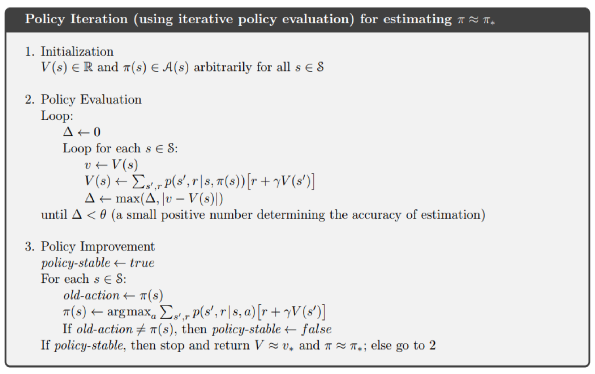

# Reinforcement_learning
## Value Iteration:

Value Iteration computes the optimal state value function by iteratively improving the estimate of V(s). The algorithm initializes V(s) to arbitrary random values then it repeatedly updates the Q(s,a) and V(s) values until they converge. Value iteration is guaranteed to converge to the optimal values.

## Policy iteration: 

The value-iteration algorithm keeps improving the value function at each iteration, until the value- function converges. Since the agent only cares about the finding the optimal policy, sometimes the optimal policy will converge before the value function. Therefore, we have another algorithm called policy-iteration. Instead of repeatedly improving the value-function estimate, it will re-define the policy at each step and compute the value according to this new policy until the policy converges. Policy iteration is also guaranteed to converge to the optimal policy and it often takes less iterations to converge than the value-iteration algorithm.

## Value-Iteration vs Policy-Iteration:
Both value-iteration and policy-iteration algorithms can be used for offline planning where the agent is assumed to have prior knowledge about the effects of its actions on the environment (they assume the MDP model is known). Comparing each other, policy-iteration is computationally efficient as it often takes considerably fewer number of iterations to converge although each iteration is more computationally expensive.
